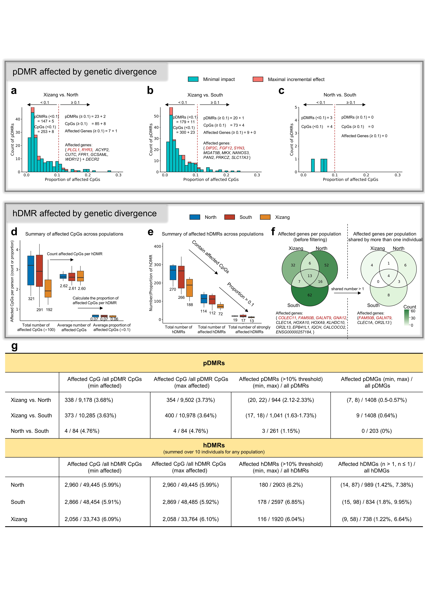

  

### Genetic Variation Effects on DNA Methylation

This module integrates **genetic variation (SNVs)** and **meQTL** information to evaluate the potential genetic contribution to methylation differences observed in **pDMRs** and **hDMRs**.  
It combines high-coverage Chinese population genomic data with public meQTL resources to assess whether DMRs are affected by local sequence variation.

---

### 1. SNV Selection and Filtering

Single nucleotide variants (SNVs) were derived from the **China 100K Genome Project** (25,169 individuals; average 30× NGS coverage).  
Variants were filtered based on **minor allele frequency (MAF > 0.05)** and **Hardy–Weinberg equilibrium (p > 1×10⁻⁶)**.  
For population-level analyses, SNVs showing **allele frequency differences > 0.1** between populations were retained, representing divergent loci at either the haplotype or population level.

---

### 2. meQTL Annotation and Classification

Filtered SNVs were annotated using the **GoDMC meQTL database** ([Nature Genetics, 2021](https://doi.org/10.1038/s41588-021-00923-x)) to identify potential CpG–SNV associations within DMRs.  
At each locus, alleles were classified as:
- **Consistent** — matching GoDMC meQTL alleles (minimal regulatory impact)  
- **Inconsistent** — diverging from GoDMC alleles (maximal regulatory potential)

To ensure compatibility with public datasets, all coordinates were converted from **hg38** to **hg19** before annotation.

---

### 3. DMR Filtering and Gene Mapping

DMRs containing **>10% of CpGs** associated with meQTL-linked SNVs were flagged as potentially influenced by genetic variation.  
For **hDMRs**, gene-level annotations were restricted to regions supported by at least **two individuals per population**.  
Filtered DMRs were then annotated with gene symbols for downstream comparison and visualization.

---

#### Summary of Scripts

| Script Name | Function | Description |
|--------------|-----------|-------------|
| `extract_SNV.sh` | Filter SNVs | Selects variants by MAF, HWE, and allele frequency difference |
| `annotate_meQTL.py` | meQTL mapping | Integrates GoDMC data and annotates CpG–SNV associations |
| `filter_DMR_by_meQTL.py` | DMR screening | Flags DMRs with >10% meQTL-associated CpGs |
| `genetic_effect_summary.R` | Visualization | Summarizes overlap and generates comparative plots |

> **Note:**  
> Ensure consistent reference versions (hg19/hg38) before annotation.  
> This analysis provides a framework for evaluating potential **genetic confounding** in methylation-based population studies.
