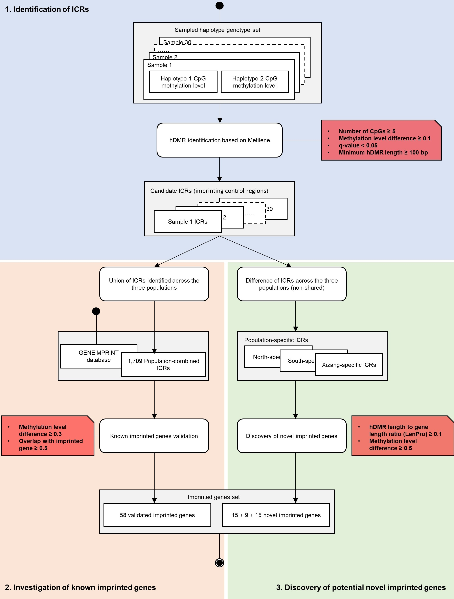

    

### Haplotype-based Differentially Methylated Region (hDMR) Analysis

This module focuses on identifying and characterizing **haplotype-based differentially methylated regions (hDMRs)** across individuals and populations.  
The analysis aims to capture allele-specific methylation differences that may underlie imprinting control and haplotype-biased regulation.

- **hDMR Detection**:  
  For each population, **10 individuals** were randomly selected to perform hDMR detection using **Metilene (v0.2.8)** with the same parameters applied in pDMR identification — a minimum number of CpGs ≥ 5, a maximum CpG distance ≤ 1000 bp, and detection mode = 1 (*de-novo*).  
  We used **Metilene** to retain regions with **length ≥ 100 bp**, **methylation difference ≥ 0.1**, **CpG count ≥ 5**, and **q-value < 0.05**.

- **Background Distribution**:  
  The genome was partitioned into **800 bp intervals** (corresponding to the average length of hDMRs, 784 bp).  
  For each interval, methylation differences between haplotype 1 and haplotype 2 were calculated to generate a background distribution, representing baseline haplotype variation across the genome.

- **Union hDMR and ICR Definition**:  
  A union set of hDMRs across all individuals was created by merging overlapping regions based on their maximum genomic span.  
  Regions overlapping with gene bodies or their **2 kb upstream** promoter sequences were defined as potential **imprinting control regions (ICRs)**.  
  For each merged ICR, ΔhDMR was defined as the arithmetic mean of absolute methylation differences between haplotypes across all constituent hDMRs:

  

  The **LenPro** parameter (hDMR density per gene) was calculated as the total hDMR length within a gene divided by the gene length.

  

- **Identification of Known and Candidate Imprinting Genes**:  
  ICRs were classified into two groups based on overlap with public datasets and population-specific criteria:
  - **Known imprinting genes** — ΔhDMR ≥ 0.3 and overlap with the **GENEIMPRINT** database ([https://www.geneimprint.com](https://www.geneimprint.com)) by ≥ 50%.  
  - **Candidate imprinting genes** — population-specific ICRs with **LenPro ≥ 0.1**, **ΔhDMR ≥ 0.5**, and **no overlap** with GENEIMPRINT.  

---

#### Summary of Data

| File | Description | Source |
|------|-------------|--------|
| `1448_nochrXY.bed` | Candidate imprinting control regions (ICRs) identified from whole-genome bisulfite sequencing (WGBS) across brain, liver, and kidney. | [*Epigenetics* (Jima *et al.*, 2022)](https://pubmed.ncbi.nlm.nih.gov/35786392/) |
| `1225_nochrXY.bed` | Independently re-sequenced candidate ICRs derived from the same WGBS cohort. | [*Epigenetics* (Jima *et al.*, 2022)](https://pubmed.ncbi.nlm.nih.gov/35786392/) |
| `golden_hg38.bed` | Repeatedly validated ICRs used as a gold-standard reference for comparison and validation. | [*Epigenetics* (Skaar *et al.*, 2012)](https://pubmed.ncbi.nlm.nih.gov/23744971/) |
| `our_ICRs.bed` | Candidate ICRs identified from merged hDMRs in this study, available via the ChinaMeth platform. | [ChinaMeth](http://bioinformatics.hit.edu.cn/chinaMeth/#/) |
| `imprint_database.id` | Curated imprinted genes compiled from multiple studies for annotation and validation of hDMRs. | [GENEIMPRINT Database](https://www.geneimprint.com/) |

> **Note:**  
> Users should configure file paths, haplotype identifiers, and reference annotation files (GENCODE/GENEIMPRINT) before execution.  
> For detailed script information, see [**hDMR**](../../scripts/hDMR).
