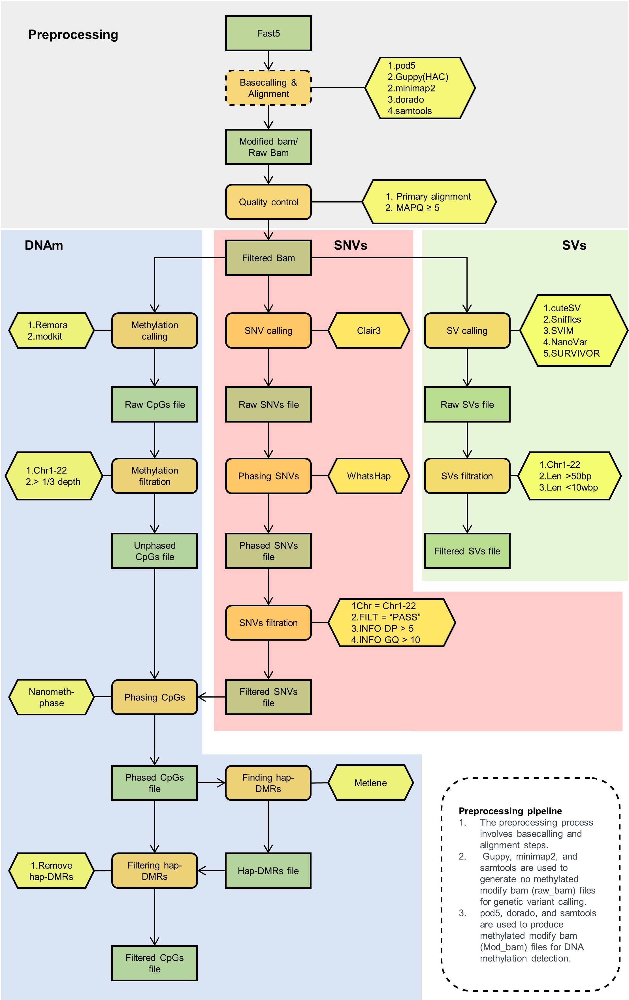

### Methylation Workflow

    

ChinaMeth provides a complete workflow for DNA methylation analysis based on Oxford Nanopore sequencing data.  
This section summarizes the experimental preparation, signal processing, methylation detection, and haplotype phasing procedures.

---

#### Sample Processing and Sequencing
High-quality genomic DNA was extracted from whole blood using the **Whole Blood Genomic DNA Purification Kit II** (MagaBio, BSC73L1E, China), following magnetic-bead purification according to the manufacturer’s protocol.  
DNA samples were quality-controlled and only those meeting the following thresholds were retained:  
1) total DNA mass ≥ 5 µg;  
2) OD260/OD280 between 1.8–2.0 and OD260/OD230 between 2.0–2.2;  
3) mean fragment length ≥ 30 kb.  

DNA was sheared to 10–15 kb using **g-TUBE (Covaris, 520079, USA)** and libraries were prepared using the **ONT Native Barcoding Kits (EXP-NBD104/EXP-NBD114)** and **Ligation Sequencing Kit (SQK-LSK109)**.  
Each **PromethION R9.4.1 (FLO-PRO002)** flow cell carried two multiplexed barcoded samples.  
Demultiplexing was performed using **Dorado (v0.3.1)** with the HAC model to minimize barcode cross-contamination.

---

#### DNA Methylation Detection
The methylation detection process consists of four major stages:

1. **Signal Conversion**:  
   Convert raw FAST5 files into **POD5** format using **Pod5-tools (v0.2.2)** with the `--one-to-one` option.  
2. **Basecalling and Alignment**:  
   Perform basecalling and alignment with **Dorado (v0.3.1)** using the `dna_r9.4.1_e8_hac@v3.3` model on **NVIDIA A100 GPUs**, aligning reads to **GRCh38 (v43)**.  
3. **Methylation Calling**:  
   Identify CpG methylation sites using **Remora (v2.1.3)** with the `dna_r9.4.1_e8_hac (v3.5.1)` model and the `infer=from_pod5_and_bam` parameter, integrating POD5-based methylation information into **modBAM** files.  
4. **Data Filtering and Aggregation**:  
   Filter reads using **Samtools (v1.9)** to retain only primary alignments on autosomes (MAPQ ≥ 5), and extract methylation data using **Modkit (v0.1.11)** with the `pileup` mode.  
   CpG methylation levels are aggregated per site (0–100%), retaining sites with coverage ≥ 1/3 of mean sequencing depth (≥3–8×).

---

#### Variant Calling and Methylation Phasing
Aligned reads were analyzed for both **SNVs** and **SVs** to support methylation phasing.  
- **SNVs** were detected using **Clair3 (v1.0.4)** and filtered with **Bcftools (v1.17)** (`FILTER=PASS`, `DP > 3`, `GQ > 10`, autosomes only).  
- **Phasing** was performed using **WhatsHap (v2.3)** with the `--enable_phasing` parameter.  
- **SVs** were identified by integrating **cuteSV (v1.0.13)**, **Sniffles (v1.0.12)**, **SVIM (v2.0.0)**, and **NanoVar (v1.3.9)**, then merged with **SURVIVOR (v1.0.6)** to retain variants between 50 bp and 100 kb.

Haplotype-specific methylation profiles were constructed using **NanoMethPhase (v1.2.0)**, converting read-level methylation into site-level values in **deepSignal (v0.2.0)** format.  
Finally, **Metilene (v0.2.8)** was applied to identify **haplotype-based DMRs (hDMRs)**, and CpG sites within hDMRs were excluded from downstream analyses to avoid allele-inconsistent bias.

---

### Additional Enrichment

In addition to the Dorado–Remora–Modkit pipeline, DNA methylation detection can also be accomplished through the **traditional Guppy + Nanopolish** workflow.  
This method follows the earlier Oxford Nanopore analysis scheme and remains compatible with most R9.4.1 datasets.

1. **Basecalling**  
   Basecalling was performed using **Guppy (v6.4.6)** with the high-accuracy model `dna_r9.4.1_450bps_hac.cfg`, producing high-quality FASTQ reads for alignment and downstream methylation analysis.
2. **Alignment**  
   Sequence reads were aligned to the human reference genome (**GRCh38**) using **Minimap2 (v2.26)** with the `-ax map-ont` parameter to generate sorted BAM files suitable for signal-level analysis.
3. **Event Alignment**  
   Using **Nanopolish (v0.13.2)**, raw signal data were aligned to the reference genome at the event level through the `eventalign` module with the `--scale-events` option, linking current signals with specific genomic positions.
4. **Methylation Calling**  
   CpG methylation sites were identified using **Nanopolish (v0.13.2)** with the `call-methylation` module, applying parameters such as `--threads`, `--reads`, `--bam`, and `--genome` to generate per-read methylation calls (`methylation_calls.tsv`).
5. **Methylation Frequency Calculation**  
   The overall CpG methylation frequency across reads was summarized using the `calculate_methylation_frequency` function in Nanopolish, producing per-site methylation ratios for downstream statistical analysis.

---

### Summary of Scripts

| Script Name | Purpose / Function | Notes |
|--------------|-------------------|-------|
| `methylation_calling.sh` | Performs basecalling, alignment, and methylation calling using Dorado + Remora + Modkit. | Requires raw POD5 files and reference genome. |
| `methylation_phasing.sh` | Conducts variant calling and haplotype phasing for methylation data. | Uses Clair3, WhatsHap, and NanoMethPhase. |
| `hDMR_calculate.sh` | Identifies and filters haplotype-specific DMRs (hDMRs) using Metilene. | Input: phased methylation data. |
| `nanopy.sh` | Runs the Guppy + Nanopolish pipeline for basecalling and methylation calling. | Optional legacy workflow. |
| `calculate_methylation_frequency.py` | Calculates methylation frequencies from Nanopolish results. | Output: site-level methylation ratios. |
| `variant_calling.sh` | Detects SNVs and SVs (cuteSV, Sniffles, SVIM, NanoVar). | Used for downstream methylation phasing. |
| `filter_methylation_data.py` | Filters CpG sites based on coverage and mapping quality. | Ensures high-confidence methylation data. |
| `merge_phased_data.sh` | Merges haplotype-resolved methylation data across individuals. | Optional step for population-scale analysis. |

> **Note:**
> Each script must be configured according to the **user’s dataset paths, reference genome, and parameter settings** before execution.  
> Example usage templates and command-line examples are provided within the `scripts/methylation_detection` directory.

