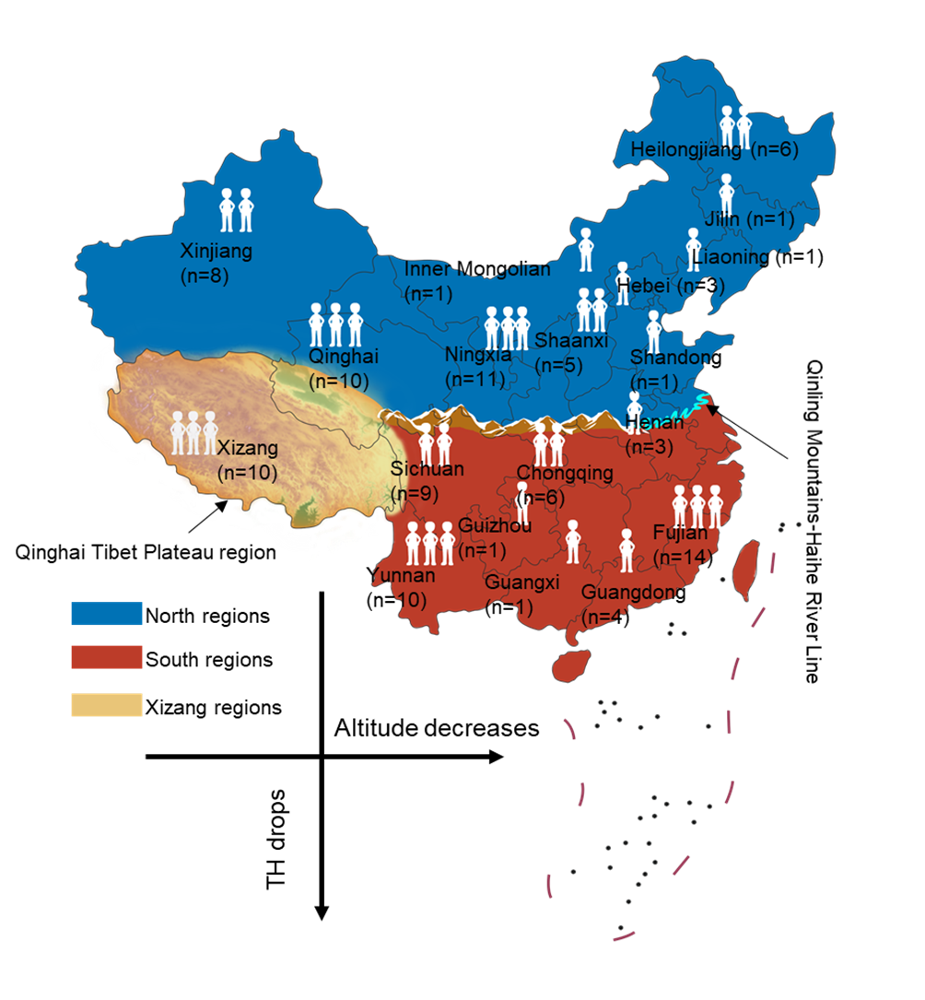

  

### Population-specific Differentially Methylated Region (pDMR) Analysis

We identified and interpreted **population-specific differentially methylated regions (pDMRs)** and their associated **differentially methylated genes (DMGs)** among the North, South, and Xizang populations. This analysis enabled inter-population methylation comparison, gene-level functional annotation, and modeling of altitude-associated methylation patterns. 
Detailed sample distribution and population grouping are shown in the figure above.

---

#### pDMR Detection

- Pairwise population comparisons were performed for **North vs. South**, **Xizang vs. North**, and **Xizang vs. South** using **Metilene (v0.2.8)**.  
- The complete set of DMRs was generated and filtered using the official **Metilene** scripts (`metilene.input.pl` and `metilene.output.pl`), retaining significant regions based on q-value and methylation difference thresholds.  
- Detected pDMRs were categorized as **hyper** (mean methylation difference > 0) or **hypo** (mean methylation difference < 0), and their genomic distributions were visualized using **TBtools (v1.115)** in circos format.

---

#### Differentially Methylated Gene (DMG) Identification

- Differentially methylated genes (DMGs) were defined by integrating pDMRs and differentially methylated CpG sites overlapping gene bodies or ±2 kb regulatory regions.
- Genes were retained if the associated DMRs contained ≥ 20 CpGs and overlapped more than 50% of the gene body, while CpG-level associations were further restricted to regions with > 40 CpGs and methylation difference ≥ 0.15. 
- Population-level comparisons were performed to identify genes showing distinct methylation profiles among high- and low-altitude groups.
- Clustering and visualization were implemented using the **ComplexHeatmap (v2.16.0)** package in R.

---

#### Altitude-associated Methylation Modeling

- Genes were classified into **high-altitude adaptation (HA)** and **novel high-altitude adaptation (nHA)** categories based on prior literature validation.  
- Statistical evaluations of methylation differences between populations employed **Wilcoxon rank-sum tests**, **Cliff’s Delta**, and **mean difference** metrics.  
- A **logistic regression model** was used to fit methylation–altitude relationships:

  

where *m₀* represents the methylation inflection point, and *k* reflects the rate of methylation change with altitude.  
Model fitting significance was assessed using the **F-statistic p-value**, and R² values were used to evaluate fit performance.

---

#### Enrichment Analysis and Discovery of Novel Altitude-adaptive Genes

To interpret the functional implications of DMGs, we performed **GO** and **KEGG** enrichment analyses using **Metascape (v3.5.20230501)**, applying the following thresholds:  
- minimum intersection ≥ 3, p-value ≤ 0.01, and enrichment factor ≥ 1.5.  
- The top 20 clusters were used to construct an **enrichment network**, where terms with similarity > 0.3 were connected by edges.  
- Outlier clusters containing fewer terms were removed using **Cytoscape (v3.10.1)**.

For identifying **novel high-altitude adaptation (HA) genes**, we applied a multi-step filtering strategy:  
- Removed nodes with degree < 15 and −log(p-value) < 15 in the enrichment network.  
- Selected one representative node per cluster based on the highest degree.  
- Retained the **top 5 nodes** with the highest degrees in the largest subnetwork, prioritizing higher −log(p-value) in case of ties.  

Finally, differences in methylation profiles for representative genes were visualized using the **NanoMethViz (v2.6.0)** R package (`plot_gene` function).

---

### Summary of Data

| File | Description |
|-------|-------------|
| `HA_noHA.genelist` | List of differentially methylated genes (DMGs) identified in the analysis. |
| `Altitude.txt` | Mean sampling altitude information for each sample or population. |
| `Enrichment.txt` | Results of functional enrichment analysis (e.g., GO and KEGG pathways). |

> **Note:**
> Ensure consistent reference genome (GRCh38) and coordinate alignment across datasets before execution.  
> For detailed script information, see [**pDMR**](../../scripts/pDMR).
