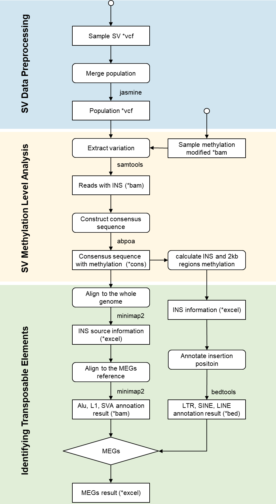
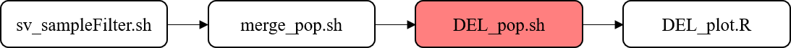

    

### Segmental Differentially Methylated Region (sDMR) Analysis

This module provides the complete workflow for identifying and analyzing **segmental differentially methylated regions (sDMRs)** associated with structural variants (SVs), including methylation normalization, classification, compensation effect estimation, and transposable element identification.  

---

#### Segmental Differential Methylated Region Detection

All SVs were merged using **Jasmine (v1.1.5)** with a minimum support threshold of 5. Filtering was performed separately for each population, applying a Hardy–Weinberg equilibrium p-value ≥ 1e−6 and a maximum missing rate ≤ 0.5.

For each variant, three methylation values were computed:
- The methylation level within the **variant body**.
- The **2 kb upstream** region.
- The **2 kb downstream** region.

Regions containing at least **5 CpGs** were retained, and the average methylation level across CpGs was used as the representative value. The **population-level methylation** of each variant was defined as the mean across individuals within that population.

To normalize segmental methylation, we used:

  

where **Methseg** represents the methylation level of the SV segment, and **Methmin** / **Methmax** are the minimum and maximum methylation values derived from the 6 kb flanking region (2 kb window size, 1 kb step).  
sDMRs were classified into three categories based on the relative methylation levels of surrounding regions:
- **High (H)** — methylation level higher than both flanks  
- **Low (L)** — methylation level lower than both flanks  
- **Other (O)** — intermediate methylation pattern  

The methylation difference of each sDMR relative to its ±2 kb flanking regions was quantified by the **Euclidean distance** (ΔsDMR), and segments with ΔsDMR > 0.5 were considered significant.

---

#### SV-Associated Methylation Level Analysis

The genome was divided into equal-length intervals with variable step sizes:
- **10 bp** for segments < 100 bp  
- **100 bp** for 100–1,000 bp  
- **1 kb** for > 1,000 bp  

The mean methylation value per interval was calculated, and background methylation was defined by the global minimum and maximum methylation levels.  

- For **DUP** and **INV**, methylation levels of the variant and its flanking regions were directly computed.  
- For **DEL**, only heterozygous sites were considered, with the non-deleted haplotype representing the deleted region.  
- For **INS**, methylation signals were re-extracted from the **modBAM** file within a 100 bp window around the insertion site. Variants with **supporting read depth (DV) < 3** were removed.  
  The retained INS regions were extended ±20 bp, and consensus sequences were generated using **abPOA (v1.5.1)**. CpGs with depth ≥ 3 were aligned to the consensus and averaged to estimate methylation levels.

#### DEL workflow

    

The DEL analysis pipeline includes the following scripts:

1. **sv_sampleFilter.sh**: Filters and standardizes SV data for individual samples. 
2. **merge_pop.sh**: Merges SV data across populations, then filters and standardizes the merged data. 
3. **DEL_pop.sh**: Calculates sDMR (significant Differentially Methylated Region) methylation levels for DELs within populations. 
4. **DEL_plot.R**: Generates scatter and density plots for DEL methylation levels.

#### INS workflow

    

The INS analysis pipeline includes the following scripts:

1. **buildBam.sh**: Extract reads from a BAM at variant coordinates. 
2. **extractReadFromINS.py**: Extracts methylation signals and sequences around INS (Insertion) variants. 
3. **compareSide2kbINS.sh**: Compares methylation levels between INS regions and their upstream/downstream 2kb regions. 
4. **ins_pop_merge.sh**: Merges individual methylation data files into a population-level file. 
5. **INS_plot.R**: Generates scatter and density plots for INS methylation levels.

---

#### Calculation of the Compensatory Fold

To evaluate **compensatory methylation effects** in heterozygous deletions, we calculated the compensatory fold as:

  

where:
- **A** — normalized methylation of the intact haplotype  
- **B** — average methylation of upstream/downstream (±2 kb) regions  
- **C** — background methylation level (84.5%)  
- **ϵ** — small constant to prevent division by zero  

Five representative samples per population were used, focusing on sDMRs ranging **250–6,500 bp** in length.  
Significant compensation was defined by |A−C| > |B−C| and |B−C| > 0.01.  
Fold changes were summarized across three length bins: 250–500 bp, 500–2,000 bp, and 2,000–6,500 bp.

---

#### Identification of Transposable Elements

INS consensus sequences were aligned to the reference genome using **minimap2 (v2.26)** in `map-ont` mode, and the **primary alignment** (mapping quality ≥ 20) was selected.  
If the alignment occurred on a different chromosome or >10 kb away from the insertion site, it was designated as the **source locus**.  
Within each population, overlapping source regions were merged to determine the most representative source position.

INS and DEL variants with a **population frequency > 50%** in any group were retained for annotation:
- **Cut-and-paste elements** — INS overlaps a DEL at the source site  
- **Copy-and-paste elements** — INS without DEL at the source site  

INS elements were aligned to **ALU**, **L1**, and **SVA** reference sequences (quality ≥ 20) using consensus data from **rMETL (v1.0.4)**, and annotated with respect to **SINE**, **LINE**, and **LTR** categories.

#### ME workflow

    

1. **reAlign.py**: Identify the source location of INS (insertion) consensus sequences.
2. **pop_reAlign.py**: Integrate the results into a group format.
3. **extract_fa.sh**: Annotate the INS with source into MEGs.

---

> **Note:**  
> Before running, ensure that all input file paths, reference genomes, and population labels are correctly configured in the corresponding scripts.
> The MEI reference genome can be referenced using super_TE.fa. 
> A complete and executable analysis pipeline can be implemented with [**methSV**](https://github.com/YLeeHIT/methSV)

