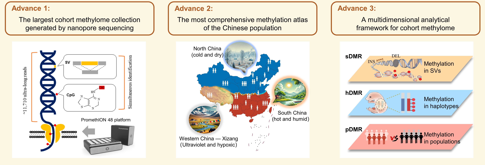
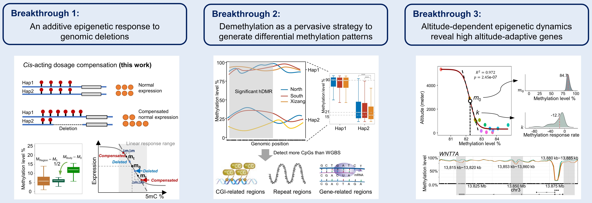

# ChinaMeth: Comprehensive DNA Methylation Analysis for Diverse Population

    

- [ChinaMeth profile](#chinameth-profile)
- [Technological advances](#technological-advances)
- [Breakgthrough findings](#breakgthrough-findings)
- [Benefits for Future Researchers](#benefits-for-future-researchers)
- [Analysis Workflow](#analysis-workflow)
    - [Methylation workflow](#methylation-workflow)
    - [Additional Enrichment (Guppy + Nanopolish Traditional Workflow)](#additional-enrichment-guppy--nanopolish-traditional-workflow)
    - [SV workflow](#sv-workflow)
    - [DEL workflow](#del-workflow)
    - [INS workflow](#ins-workflow)
    - [ME workflow](#me-workflow)
- [Demo & Usage Examples](#demo--usage-examples)
    - [Folder Overview](#folder-overview)
    - [Example: `DEL/` - Deletion Pipeline](#example-del---deletion-pipeline)
    - [Example: `INS/` - Insertion Pipeline](#example-ins---insertion-pipeline)
    - [Example: `MEG/` - Mobile Element Pipeline](#example-me---mobile-element-pipeline)
- [Directory Structure](#directory-structure)
- [Release](#release)
    - [v1.1 Release Notes](#v11-release-notes)
    - [v1.2 Release Notes](#v12-release-notes)
    - [v1.3 Release Notes](#v13-release-notes)
    - [v1.4 Release Notes](#v14-release-notes)
- [Website](#website)
- [Future Work](#future-work)
- [License](#license)
- [Citation](#citation)
- [Contact](#contact)

## ChinaMeth profile

    

Welcome to **ChinaMeth**, a project dedicated to exploring the complex patterns of DNA methylation across diverse Chinese populations using nanopore sequencing technologies. This repository provides insights into our comprehensive study of methylation dynamics and their role in genetic regulation and environmental adaptation. It also includes scripts for data processing and visulization to facilitate methylation studies.

## Technological advances

    

- **The largest Chinese cohort methylome collection generated by nanopore sequencing**: Long-read sequencing of native DNA enables genome-methylome co-sequencing, offers high-resolution methylation characterization in repetitive sequences, and enables Mb-scale haplotype phasing.

- **The most comprehensive methylation atlas of the Chinese population**: Representing the second phase of the China 100,000 Genomes Project, the cohort involves 106 individuals across diverse geographical regions encompassing a multitude of environmental gradients.

- **A multidimensional analytical framework for cohort methylome**: This integrated framework allows the unified analysis of segmental, haplotype-specific and population-specific differential methylations. Our study reveals epigenetic associations with genomic structural variants (for the first time), genetic imprints and population adaptations.

## Breakgthrough findings

    

- **An additive epigenetic response to genomic deletions**
We found that genome-wide large deletions are associated with localized, **~2-fold epigenetic compensation** on their undeleted counterpart. We also found that genomic background methylation falls into a linear response region of gene regulation. Both observations suggest a novel, general principle of **cis-acting** epigenetic compensation to maintain gene expression regulation in the presence of DNA fragment loss.

- **Demethylation as a pervasive strategy to generate differential methylation patterns**
Through haplotype- and population-level comparative analysis, we expanded the sets of potential imprinted genes and epigenetically adapted genes by hundreds to thousands. We observed previously less-characterized genomic regions as a hot spot of demethylation for epigenetic adaptability.

- **Altitude-dependent epigenetic dynamics**
Leveraging the altitude gradient data, we established for the first time **quantitative response curves for epigenetic regulation**, which revealed 639 genes subject to strong epigenetic regulation toward high-altitude (HA) adaptation. Further analysis identified core regulators of HA adaptation, whereas certain previously known HA genes were not epigenetically regulated.

## Benefits for Future Researchers
- **Comprehensive ONT Analysis Pipeline**: ChinaMeth offers a complete ONT analysis workflow, including essential scripts for key processing steps, streamlining data analysis for new users and experienced researchers alike.

- **Open Data Access with Interactive Visualization**: The platform provides open access to methylation data with an interactive visualization interface, enabling researchers to explore and interpret methylation patterns across populations with ease.

- **Novel Findings for Reference**: ChinaMeth presents a range of unique insights and findings, providing valuable references and hypotheses for future research in epigenetics and population studies.

## Analysis Workflow
ChinaMeth provides a comprehensive workflow for DNA methylation data analysis. This workflow encompasses essential analysis scripts for processing methylation data, conducting SV-methylation correlation analyses, and generating visualizations.

### Methylation workflow

    

The Methylation analysis pipeline includes the following scripts:

1. **methylation_calling.sh**: Performs DNA basecalling, alignment, and methylation calling.
2. **methylation_phasing.sh**: Performs phasing and calculates haplotype-specific methylation frequencies.
3. **hDMR_calculate.sh**: Calculates and filters DMRs and DMCs.

### Additional Enrichment

For users interested in the traditional Guppy + Nanopolish workflow, we provide the following scripts:

- **nanopy.sh**: Executes the traditional Guppy + Nanopolish workflow for basecalling and methylation calling.
- **calculate_methylation_frequency.py**: Computes methylation frequency based on Nanopolish results.

### SV workflow

    

**SV Workflow** is a comprehensive workflow designed for analyzing methylation patterns in structural variants (SVs). The workflow consists of the following three main steps:
1. **SV Data Preprocessing**: Integrate individual data into a population-level dataset and perform data filtering and quality control. This step ensures data integrity and reliability for downstream analysis.
2. **SV Methylation Level Analysis**: Perform detailed analysis of methylation patterns in SV regions, with a focus on:
- **DEL Workflow**: Analyze methylation patterns in deletion (DEL) regions to explore their distribution and potential functional roles within the genome.
- **INS Workflow**: Investigate methylation patterns in insertion (INS) regions to uncover changes in methylation levels during the insertion process.
3. **Identifying Transpoable Elements**:Examine changes in methylation patterns of insertion (INS) regions as transposable elements (TEs). Using the **MEG Workflow**, this step explores the mechanisms behind methylation dynamics in TEs and their impact on genome stability.

### DEL workflow

    

The DEL analysis pipeline includes the following scripts:

1. **sv_sampleFilter.sh**: Filters and standardizes SV data for individual samples. 
2. **merge_pop.sh**: Merges SV data across populations, then filters and standardizes the merged data. 
3. **DEL_pop.sh**: Calculates sDMR (significant Differentially Methylated Region) methylation levels for DELs within populations. 
4. **DEL_plot.R**: Generates scatter and density plots for DEL methylation levels.

### INS workflow

    

The INS analysis pipeline includes the following scripts:

1. **extractReadFromINS.py**: Extracts methylation signals and sequences around INS (Insertion) variants. 
2. **compareSide2kbINS.sh**: Compares methylation levels between INS regions and their upstream/downstream 2kb regions. 
3. **ins_pop_merge.sh**: Merges individual methylation data files into a population-level file. 
4. **INS_plot.R**: Generates scatter and density plots for INS methylation levels.

### ME workflow

    

1. **reAlign.py**: Identify the source location of INS (insertion) consensus sequences.
2. **pop_reAlign.py**: Integrate the results into a group format.
3. **extract_fa.sh**: Annotate the INS with source into MEGs.

## Demo & Usage Examples

Each folder in the `scripts/` directory corresponds to a specific pipeline or analysis module. We provide usage demos with input data, expected output, and step-by-step instructions.

### Folder Overview

| Folder | Description | Example Available |
|--------|-------------|-------------------|
| `DEL/` | Pipeline for deletion (DEL) events | ✅ |
| `INS/` | Pipeline for insertion (INS) events | ✅ |
| `MEG/` | Pipeline for mobile element events | ✅|    
| `ONT/` | The process from fast5 signal to final bed methylation file | ❌|
| `Others/` | Miscellaneous scripts and utilities |❌| 

---

###  Example: `DEL/` - Deletion Pipeline

**1. Description:**

This pipeline identifies methylation signatures around DEL events and summarizes them by sample and region.

**2. Input files:**

The input VCF file should be **structural variation calls that have been force-called** using tools like `cuteSV`, `Sniffles`, `SVIM`, and `NanoVar`.

**3. Run scripts:**

| Step | Script Path | Command | Description | Input | Output |
|------|-------------|---------|-------------|--------|--------|
| 1 | `scripts/DEL/sv_sampleFilter.sh` | `bash ../../scripts/DEL/sv_sampleFilter.sh sam1` | Filter and standardize individual VCF file | `sam1.vcf.gz` | `sam1.Filter.Stand.vcf.gz` |
| 2 | `scripts/DEL/merge_pop.sh` | `bash ../../scripts/DEL/merge_pop.sh inlist.txt 2 pop` | Merge individual VCFs into a population-level VCF | `inlist.txt` (list of VCFs) | `pop_filtered_DEL_AC2.vcf` |
| 3 | `scripts/DEL/DEL_pop.sh` | `bash ../../scripts/DEL/DEL_pop.sh pop_filtered_DEL_AC2.vcf pop 0_sam1` | Extract heterozygous deletions (DELs) from population VCF | `pop_filtered_DEL_AC2.vcf` | `pop_0_sam1.cpg` |
| 4 | `scripts/DEL/DEL_plot.R` |  | Draw scatter plots and density maps of DEL and its flanking regions | Path to the DEL methylation data file (file_path), Threshold for filtering DELs based on methylation difference (cutoff)  | Figures (tiff) |

**4. Expected output:**

The output cpg files include heterozygous deletions and their surrounding methylation context.

###  Example: `INS/` - Insertion Pipeline

**1. Description:**

The INS analysis pipeline focuses on extracting and analyzing DNA methylation signals around insertion (INS) structural variants.

**2. Input files:**

Input files are BAM files processed with Dorado and Remora, containing methylation modification signals.

**3. Run scripts:**

| Step | Script Path | Command | Description | Input | Output |
|------|-------------|---------|-------------|--------|--------|
| 1 | `extractReadFromINS.py` | `python ../../scripts/INS/extractReadFromINS.py --bam sam1_chr1_710579.txt --vcf chr1_710579.txt --out ./out` | Extracts methylation signals and sequences around INS variants | Bam file, vcf position file | `sam1.meth` |
| 2 | `compareSide2kbINS.sh` | `bash compareSide2kbINS.sh sam1` | Compares methylation levels between INS and ±2kb flanking regions | sample ID | `sam1_ins.cpg` |
| 3 | `ins_pop_merge.sh` | `bash ins_pop_merge.sh pop` | Merges individual methylation files into a population-level file | Population ID | `pop.result` |
| 4 | `INS_plot.R` |  | Generates scatter and density plots for INS methylation patterns | Path to the data file (file_path), The threshold for filtering out small methylation differences (cutoff) | Figures (tiff) |

**4. Expected output:**

Raw methylation data extracted from INS and flanking regions.

###  Example: `MEG/` - Mobile Element Pipeline

**1. Description:**

The MEG analysis builds upon the results from the INS pipeline. It traces the origin of insertion sequences identified in `INS/`, and determines whether these insertions originate from known transposable elements (TEs).

This module includes scripts and example results to illustrate the analysis workflow.
**Note:** Paths inside the scripts may need to be manually updated based on your environment and file structure.

**2. Input files:**

`sam1_5.cpg`: Methylation file generated from the INS pipeline, representing insertion sequences that contain at least 5 CpG sites.

**3. Run scripts:**

| Step | Script Path | Command | Description | Input | Output |
|------|-------------|---------|-------------|--------|--------|
| 1 | `reAlign.py` | `python reAlign.py --sample sam1 --population pop` | Identifies the source location of INS  consensus sequences based on methylation | CpG files | `sam1_reAlign_filter.result` |
| 2 | `pop_reAlign.py` | `python pop_reAlign.py --population pop` | Merges individual INS analysis results into a single population-level result | Population ID | `pop_reAlign.result` |
| 3 | `extract_fa.sh` | `bash extract_fa.sh sam1 pop` | Annotates INS (insertion) sequences by aligning them to TEs sequences | Sample ID, Population ID | `pop_merge.result` |

**4. Expected output:**

- `pop_reAlign.result`: Integrated methylation data across all individuals for mobile element (ME) insertions.

- `pop_merge.result`: Combined result of `pop_reAlign.result` with transposable element (TE) annotation.

## Website

Explore CpG and three types of DMR distributions, including sDMR, hDMR, and pDMR, on our interctive [ChinaMeth](http://bioinformatics.hit.edu.cn/methylation).

## Future Work

To enhance the reproducibility and scope of structural variant (SV)-associated methylation analysis, we are developing `methSV`, a modular and fully executable Nextflow pipeline.

This upcoming workflow will address a key limitation in the current Oxford Nanopore EPI2ME platform: the lack of SV-aware methylation signal extraction and joint analysis. By integrating SV annotations (e.g., from Sniffles) with modified base information (e.g., from Remora-annotated modBAM files), `methSV` will allow users to extract, quantify, and visualize DNA methylation patterns across SV regions, including insertions (INS), deletions (DEL), and mobile element insertions (MEG).

Importantly, this pipeline will consolidate and formalize the core scripts previously developed within this repository, including those used for DEL, INS, and MEG-specific methylation analyses. These scripts will be encapsulated into a unified, scalable framework based on Nextflow, enabling:

- Region-based methylation extraction from SV-overlapping modBAM files
- Automated, parallelizable execution on local or cloud infrastructure
- Easy customization and reproducibility across studies
- Seamless integration with population-scale SV datasets

## Release

### v1.4 Release Notes

- Added support for Mobile Element-associated Genomic methylation (MEG) analysis and annotation
- Implemented scripts for extracting methylation levels around ME insertions
- Provided demo data and usage examples for the MEG module
- Updated MEG folder with structured workflow and documentation

### v1.3 Release Notes

- Fixed bug in INS processing pipeline related to methylation extraction
- Added complete INS module demo (input data, script, expected output)
- Updated INS folder structure and usage guide

### v1.2 Release Notes

- Fixed bug in DEL processing pipeline related to methylation extraction
- Added complete DEL module demo (input data, script, expected output)
- Updated DEL folder structure and usage guide

### v1.1 Release Notes

- Added basic project description
- Provided core scripts for structural variation and methylation analysis
- Updated README with usage instructions
- Organized initial workflow structure, including INS, DEL, and ONT modules

For the stable version, please use the `main` branch 

## License
This project is licensed under the MIT License. See the [LICENSE](LICENSE) file for more details.

## Citation
If you use ChinaMethAtlas in your research, please cite the following paper: **A comprehensive DNA methylation atlas for the Chinese population through nanopore long-read sequencing of 106 individuals**

## Contact
For any questions, please contact [email](yli21b@hit.edu.cn)
