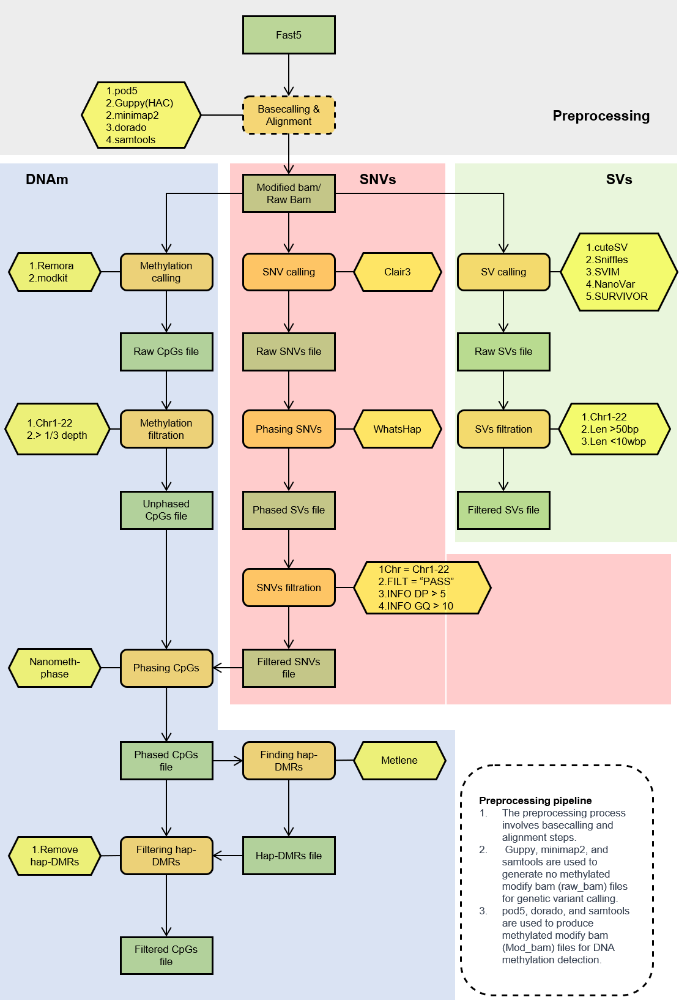
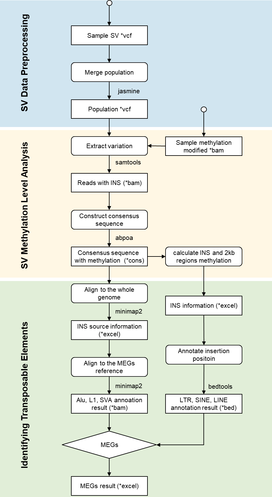
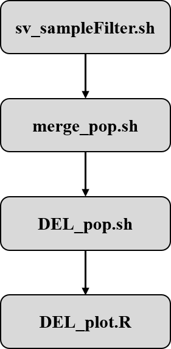

# ChinaMeth: Comprehensive DNA Methylation Analysis for Diverse Population

    

### A comprehensive DNA methylation atlas for the Chinese population through nanopore long-read sequencing of 106 individuals
Welcome to **ChinaMeth**, a project dedicated to exploring the complex patterns of DNA methylation across diverse Chinese populations using advanced long-read sequencing technologies. This repository provides insights into our comprehensive study of methylation dynamics and their role in genetic regulation and environmental adaptation. It also includes scripts for data processing and visulization to facilitate methylation studies.

## Key Features and Advantages
- **Population-Specific Insights**: By examining distinct populations (e.g., northern, southern, and xizang groups), ChinaMeth provides a deeper understanding of the methylation landscape and the potential influence of regional adaptations.
- **Advanced Technology**: Fully leveraging the advantages of long-read sequencing, ChinaMeth addresses limitations found in second-generation studies, providing high-resolution methylation data that uncovers patterns often overlooked by traditional methods.
- **Interactive Data Exploration**: ChinaMeth provides an online, interactive data visualization platform to facilitate research on methylation patterns across populations. This open-access resource allows researchers to explore and analyze methylation data seamlessly, supporting diverse epigenetic studies

## Novel Findings
ChinaMeth has unveiled several unique findings, such as:
- Elevated methylation levels in specific structural variations, with significant implications for regional adaptation.
- Identification of unique haplotype-based methylation patterns, especially among genes related to environmental resilience.
- Insights into hypo-methylation patterns distinctive to certain populations, suggesting underlying epigenetic regulation mechanisms influenced by local environments.

## Benefits for Future Researchers
- **Comprehensive ONT Analysis Pipeline**: ChinaMeth offers a complete ONT analysis workflow, including essential scripts for key processing steps, streamlining data analysis for new users and experienced researchers alike.
- **Open Data Access with Interactive Visualization**: The platform provides open access to methylation data with an interactive visualization interface, enabling researchers to explore and interpret methylation patterns across populations with ease.
- **Novel Findings for Reference**: ChinaMeth presents a range of unique insights and findings, providing valuable references and hypotheses for future research in epigenetics and population studies.

## Analysis Workflow
ChinaMeth provides a comprehensive workflow for DNA methylation data analysis. This workflow encompasses essential analysis scripts for processing methylation data, conducting SV-methylation correlation analyses, and generating visualizations.

### Methylation workflow

    

The Methylation analysis pipeline includes the following scripts:

1. **methylation_calling.sh**: Performs DNA basecalling, alignment, and methylation calling.
2. **methylation_phasing.sh**: Performs phasing and calculates haplotype-specific methylation frequencies.
3. **hDMR_calculate.sh**: Calculates and filters DMRs and DMCs.

### Additional Enrichment (Guppy + Nanopolish Traditional Workflow)

For users interested in the traditional Guppy + Nanopolish workflow, we provide the following scripts:

- **nanopy.sh**: Executes the traditional Guppy + Nanopolish workflow for basecalling and methylation calling.
- **calculate_methylation_frequency.py**: Computes methylation frequency based on Nanopolish results.

### SV workflow

    

### DEL workflow

    

The DEL analysis pipeline includes the following scripts:

1. **sv_sampleFilter.sh**: Filters and standardizes SV data for individual samples. 
2. **merge_pop.sh**: Merges SV data across populations, then filters and standardizes the merged data. 
3. **DEL_pop.sh**: Calculates sDMR (significant Differentially Methylated Region) methylation levels for DELs within populations. 
4. **DEL_plot.R**: Generates scatter and density plots for DEL methylation levels.

## Feature
- Data preprocessing scripts
- Data analysis methods
- Visulization tools for results

## Directory Structure
- `data/`: Contains raw and processed data files
    - `DEL/`: Scripts specific to DEL analysis, including sample filtering, population merging, methylation level calculation, and plotting.
- `scripts/`: Contains scripts for data processing and analysis
- `plots/`: Contains generated plots and visualizations
- `docs/`: Documentation and Usage instructions

## Website
Explore CpG and three types of DMR distributions, including sDMR, hDMR, and pDMR, on our interctive [ChinaMeth](http://bioinformatics.hit.edu.cn/methylation).

## License
This project is licensed under the MIT License. See the [LICENSE](LICENSE) file for more details.

## Citation
If you use ChinaMethAtlas in your research, please cite the following paper: **A Comprehensive Tool for DNA Methylation Analysis in the Chinese population.**

## Contact
For any questions, please contact [email](yli21b@hit.edu.cn)
