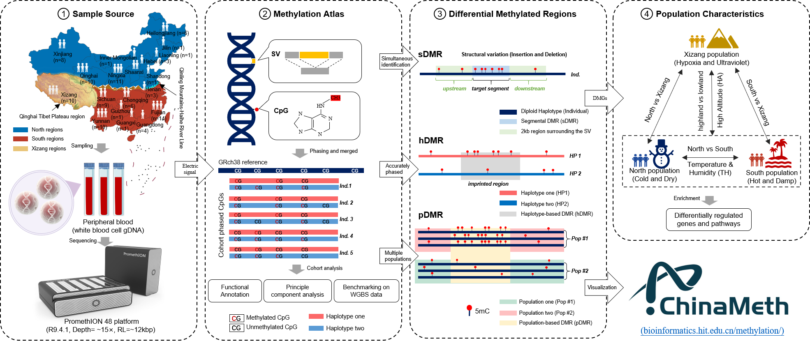
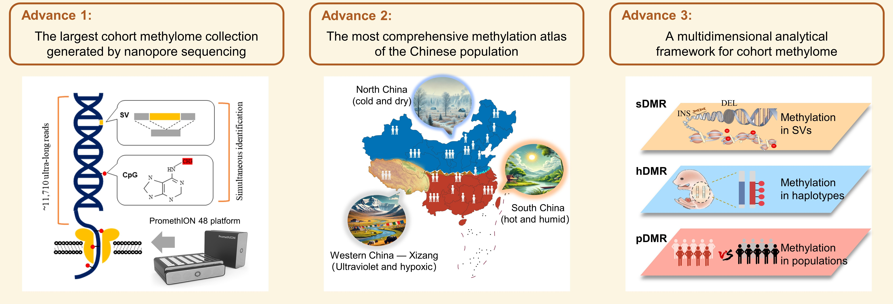

<div align="left">
    
</div>


- [ChinaMeth profile](#chinameth-profile)
- [Technological advances](#technological-advances)
- [Breakgthrough findings](#breakgthrough-findings)
- [Benefits for Future Researchers](#benefits-for-future-researchers)
- [Installation](#installation)
- [Analysis Modules](#analysis-modules)
    - [Methylation Detection](#methylation-detection)
    - [CpG Annotation and Statistics](#cpg-annotation-and-statistics)
    - [sDMR Analysis](#sdmr-analysis)
    - [hDMR Analysis](#hdmr-analysis)
    - [pDMR Analysis](#pdmr-analysis)
    - [Genetic Variation Effects](#genetic-variation-effects)
    - [Functional Enrichment Analysis](#functional-enrichment-analysis)
- [Website](#website)
- [Future Work](#future-work)
- [License](#license)
- [Release](#release)
- [Citation](#citation)
- [Contact](#contact)

## ChinaMeth profile

<div align="center">
    
</div>

Welcome to **ChinaMeth**, a project dedicated to exploring the complex patterns of DNA methylation across diverse Chinese populations using nanopore sequencing technologies. This repository provides insights into our comprehensive study of methylation dynamics and their role in genetic regulation and environmental adaptation. It also includes scripts for data processing and visulization to facilitate methylation studies.


## Technological advances

<div align="center">
    
</div>

- **The largest Chinese cohort methylome collection generated by nanopore sequencing**: Long-read sequencing of native DNA enables genome-methylome co-sequencing, offers high-resolution methylation characterization in repetitive sequences, and enables Mb-scale haplotype phasing.

- **The most comprehensive methylation atlas of the Chinese population**: Representing the second phase of the China 100,000 Genomes Project, the cohort involves 106 individuals across diverse geographical regions encompassing a multitude of environmental gradients.

- **A multidimensional analytical framework for cohort methylome**: This integrated framework allows the unified analysis of segmental, haplotype-specific and population-specific differential methylations. Our study reveals epigenetic associations with genomic structural variants (for the first time), genetic imprints and population adaptations.


## Breakgthrough findings

<div align="center">
    
</div>

- **An additive epigenetic response to genomic deletions**
We found that genome-wide large deletions are associated with localized, **~2-fold epigenetic compensation** on their undeleted counterpart. We also found that genomic background methylation falls into a linear response region of gene regulation. Both observations suggest a novel, general principle of **cis-acting** epigenetic compensation to maintain gene expression regulation in the presence of DNA fragment loss.

- **Demethylation as a pervasive strategy to generate differential methylation patterns**
Through haplotype- and population-level comparative analysis, we expanded the sets of potential imprinted genes and epigenetically adapted genes by hundreds to thousands. We observed previously less-characterized genomic regions as a hot spot of demethylation for epigenetic adaptability.

- **Altitude-dependent epigenetic dynamics**
Leveraging the altitude gradient data, we established for the first time **quantitative response curves for epigenetic regulation**, which revealed 639 genes subject to strong epigenetic regulation toward high-altitude (HA) adaptation. Further analysis identified core regulators of HA adaptation, whereas certain previously known HA genes were not epigenetically regulated.

## Benefits for Future Researchers
- **Comprehensive ONT Analysis Pipeline**: ChinaMeth offers a complete ONT analysis workflow, including essential scripts for key processing steps, streamlining data analysis for new users and experienced researchers alike.

- **Open Data Access with Interactive Visualization**: The platform provides open access to methylation data with an interactive visualization interface, enabling researchers to explore and interpret methylation patterns across populations with ease.

- **Novel Findings for Reference**: ChinaMeth presents a range of unique insights and findings, providing valuable references and hypotheses for future research in epigenetics and population studies.

## Installation
- **Project Nature**: ChinaMethAtlas is an engineering-oriented GitHub repository, focusing on the organization of data, analysis scripts, and visualization modules rather than a standalone software package.
  We recommend installing only the tools and dependencies you actually need.
  Note that **Dorado** must be manually downloaded and installed from the official Oxford Nanopore Technologies GitHub repository: [https://github.com/nanoporetech/dorado/releases](https://github.com/nanoporetech/dorado/releases).

  - **Python Environment**:  
    Please use the **latest stable version of Python** (≥ 3.10) to ensure compatibility.  
    You can create a dedicated environment as follows:
    ```bash
    ### Clone
    git clone https://github.com/YLeeHIT/ChinaMethAtlas.git
    cd ChinaMethAtlas
    
    ### create environemnt
    conda create -n chinameth python=3.12 r-base=4.4
    conda activate chinameth

    ### Optional: install softwares
    conda env update -n chinameth -f environment.yml
    ```


## Analysis Overview
ChinaMeth provides a comprehensive framework for DNA methylation data analysis, integrating methylation detection, annotation, differential analysis, and functional interpretation.  
All detailed analysis descriptions can be found in the **Document** directory, and the corresponding analysis scripts are available under the **scripts** folder.

### Methylation Detection
This module covers the complete processing of Oxford Nanopore raw signal data into high-confidence methylation profiles, including:

- **Signal Conversion**: Transforming raw electrical signals (`.pod5` files) into basecalled sequence data using **Dorado**.  
- **Quality Control**: Filtering out low-quality reads and alignments to ensure accurate methylation detection using **Samtools**.  
- **Methylation Calling**: Detecting CpG methylation signals from aligned reads using **Remora** and **Modkit**.  
- **Phasing Analysis**: Performing methylation phasing to distinguish allele- or haplotype-specific methylation patterns with **NanoMethPhase**.  

Detailed procedures are documented in [**methylation_detection.md**](Document/methylation_detection/methylation_detection.md).


## Website

Explore CpG and three types of DMR distributions, including sDMR, hDMR, and pDMR, on our interctive [ChinaMeth](http://bioinformatics.hit.edu.cn/chinaMeth/#/).

## Future Work

To enhance the reproducibility and scope of structural variant (SV)-associated methylation analysis, we are developing `methSV`, a modular and fully executable Nextflow pipeline.

This upcoming workflow will address a key limitation in the current Oxford Nanopore EPI2ME platform: the lack of SV-aware methylation signal extraction and joint analysis. By integrating SV annotations (e.g., from Sniffles) with modified base information (e.g., from Remora-annotated modBAM files), `methSV` will allow users to extract, quantify, and visualize DNA methylation patterns across SV regions, including insertions (INS), deletions (DEL), and mobile element insertions (MEG).

Importantly, this pipeline will consolidate and formalize the core scripts previously developed within this repository, including those used for DEL, INS, and MEG-specific methylation analyses. These scripts will be encapsulated into a unified, scalable framework based on Nextflow, enabling:

- Region-based methylation extraction from SV-overlapping modBAM files
- Automated, parallelizable execution on local or cloud infrastructure
- Easy customization and reproducibility across studies
- Seamless integration with population-scale SV datasets

## Release

### v1.5 Release Notes
- Added detailed documentation describing the complete analysis workflow
- Supplemented scripts and data for sDMR, pDMR, and hDMR analyses

### v1.4 Release Notes

- Added support for Mobile Element-associated Genomic methylation (MEG) analysis and annotation
- Implemented scripts for extracting methylation levels around ME insertions
- Provided demo data and usage examples for the MEG module
- Updated MEG folder with structured workflow and documentation

### v1.3 Release Notes

- Fixed bug in INS processing pipeline related to methylation extraction
- Added complete INS module demo (input data, script, expected output)
- Updated INS folder structure and usage guide

### v1.2 Release Notes

- Fixed bug in DEL processing pipeline related to methylation extraction
- Added complete DEL module demo (input data, script, expected output)
- Updated DEL folder structure and usage guide

### v1.1 Release Notes

- Added basic project description
- Provided core scripts for structural variation and methylation analysis
- Updated README with usage instructions
- Organized initial workflow structure, including INS, DEL, and ONT modules

For the stable version, please use the `main` branch 

## License
This project is licensed under the MIT License. See the [LICENSE](LICENSE) file for more details.

## Citation
If you use ChinaMethAtlas in your research, please cite the following paper: **A comprehensive DNA methylation atlas for the Chinese population through nanopore long-read sequencing of 106 individuals**

## Contact
For any questions, please contact [email](yli21b@hit.edu.cn)
