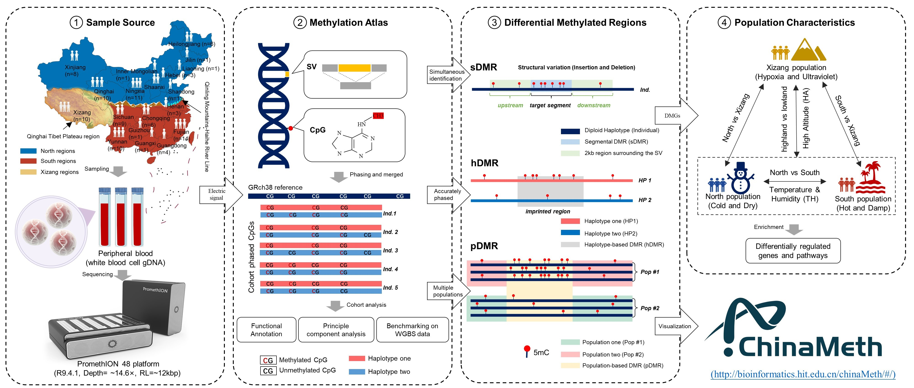
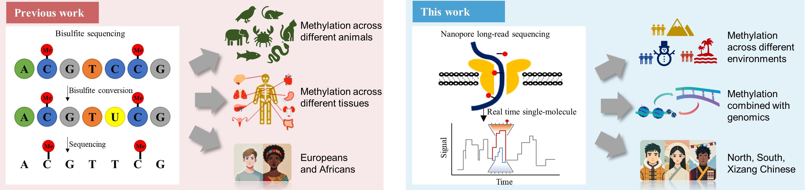
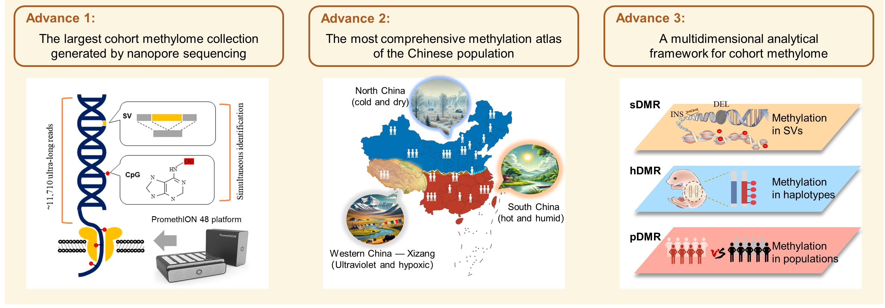
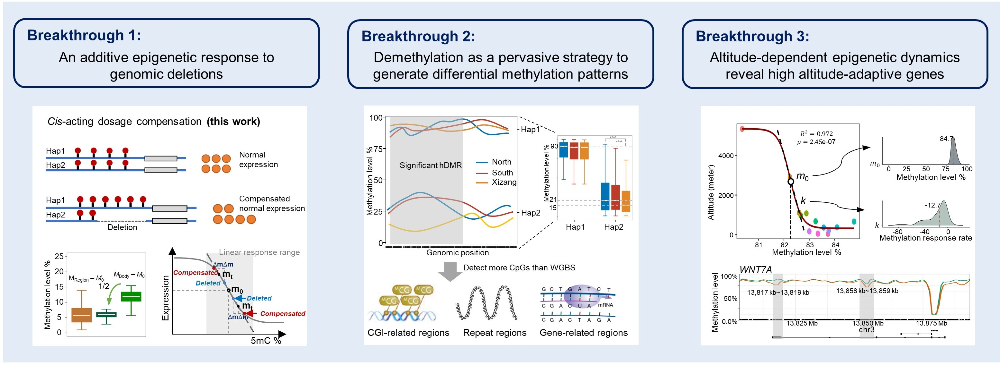

<div align="left">
    
</div>

---

- [ChinaMeth profile](#chinameth-profile)
- [Technological advances](#technological-advances)
- [Breakgthrough findings](#breakgthrough-findings)
- [Benefits for Future Researchers](#benefits-for-future-researchers)
- [Installation](#installation)
- [Analysis](#analysis)
    - [Methylation Detection](#methylation-detection)
    - [CpG Annotation and Statistics](#cpg-annotation-and-statistics)
    - [sDMR Analysis](#segmental-differentially-methylated-regions-sdmr)
    - [hDMR Analysis](#haplotype-based-differentially-methylated-regions-hdmr)
    - [pDMR Analysis](#population-based-differentially-methylated-regions-pdmr)
    - [Genetic Variation Effects](#genetic-variation-effects-on-dna-methylation)
- [Website](#website)
- [License](#license)
- [Release](#release)
- [Citation](#citation)
- [Contact](#contact)

## ChinaMeth profile
<div align="center">
    
</div>

- Welcome to **ChinaMeth**, a project dedicated to exploring the complex patterns of DNA methylation across diverse Chinese populations using nanopore sequencing technologies. This repository provides insights into our comprehensive study of methylation dynamics and their role in genetic regulation and environmental adaptation. It also includes scripts for data processing and visulization to facilitate methylation studies.

## Study Overview
<div align="center">
    
</div>

- Earlier population-scale DNA methylation studies primarily relied on **array-based** or **bisulfite sequencing** technologies, which, although informative, provided only a **partial and biased view** of the methylome. These methods were constrained by short-read lengths, limited CpG site coverage, and the inability to resolve **haplotype- or allele-specific methylation**. Moreover, most previous datasets lacked integration with **genomic structural variants (SVs)** and **environmental parameters**, limiting the exploration of how genetic and environmental factors jointly shape epigenetic diversity.

- In contrast, **ChinaMeth** leverages **Oxford Nanopore long-read sequencing** to achieve **base-resolution and haplotype-resolved DNA methylation profiling** across large, geographically diverse human populations. This strategy enables the simultaneous detection of **genetic variants**, **structural variations**, and **methylation modifications** within the same individuals, offering a **complete and unbiased methylome representation**. By coupling long-range methylation information with population and environmental metadata, ChinaMeth provides a powerful framework for dissecting **genetic–epigenetic–environmental interactions** that underpin population-level phenotypic diversity.

## Technological advances

<div align="center">
    
</div>

- **The largest Chinese cohort methylome collection generated by nanopore sequencing**: Long-read sequencing of native DNA enables genome-methylome co-sequencing, offers high-resolution methylation characterization in repetitive sequences, and enables Mb-scale haplotype phasing.

- **The most comprehensive methylation atlas of the Chinese population**: Representing the second phase of the China 100,000 Genomes Project, the cohort involves 106 individuals across diverse geographical regions encompassing a multitude of environmental gradients.

- **A multidimensional analytical framework for cohort methylome**: This integrated framework allows the unified analysis of segmental, haplotype-specific and population-specific differential methylations. Our study reveals epigenetic associations with genomic structural variants (for the first time), genetic imprints and population adaptations.


## Breakgthrough findings

<div align="center">
    
</div>

- **An additive epigenetic response to genomic deletions**
We found that genome-wide large deletions are associated with localized, **~2-fold epigenetic compensation** on their undeleted counterpart. We also found that genomic background methylation falls into a linear response region of gene regulation. Both observations suggest a novel, general principle of **cis-acting** epigenetic compensation to maintain gene expression regulation in the presence of DNA fragment loss.

- **Demethylation as a pervasive strategy to generate differential methylation patterns**
Through haplotype- and population-level comparative analysis, we expanded the sets of potential imprinted genes and epigenetically adapted genes by hundreds to thousands. We observed previously less-characterized genomic regions as a hot spot of demethylation for epigenetic adaptability.

- **Altitude-dependent epigenetic dynamics**
Leveraging the altitude gradient data, we established for the first time **quantitative response curves for epigenetic regulation**, which revealed 639 genes subject to strong epigenetic regulation toward high-altitude (HA) adaptation. Further analysis identified core regulators of HA adaptation, whereas certain previously known HA genes were not epigenetically regulated.

## Benefits for Future Researchers
- **Comprehensive ONT Analysis Pipeline**: ChinaMeth offers a complete ONT analysis workflow, including essential scripts for key processing steps, streamlining data analysis for new users and experienced researchers alike.

- **Open Data Access with Interactive Visualization**: The platform provides open access to methylation data with an interactive visualization interface, enabling researchers to explore and interpret methylation patterns across populations with ease.

- **Novel Findings for Reference**: ChinaMeth presents a range of unique insights and findings, providing valuable references and hypotheses for future research in epigenetics and population studies.

## Installation
- **Project Nature**: ChinaMethAtlas is an engineering-oriented GitHub repository, focusing on the organization of data, analysis scripts, and visualization modules rather than a standalone software package.
  We recommend installing only the tools and dependencies you actually need.
  Note that **Dorado** must be manually downloaded and installed from the official Oxford Nanopore Technologies GitHub repository: [https://github.com/nanoporetech/dorado/releases](https://github.com/nanoporetech/dorado/releases).

- **Python Environment**:  
  Please use the **latest stable version of Python** (≥ 3.10) to ensure compatibility.  
  You can create a dedicated environment as follows:
  ```bash
  ### Clone
  git clone https://github.com/YLeeHIT/ChinaMethAtlas.git
  cd ChinaMethAtlas
    
  ### create environemnt
  conda create -n chinameth python=3.12 r-base=4.4
  conda activate chinameth

  ### Optional: install softwares
  conda env update -n chinameth -f environment.yml
  ```

## Analysis
ChinaMeth provides a comprehensive framework for DNA methylation data analysis, integrating methylation detection, annotation, differential analysis, and functional interpretation.  
All detailed analysis descriptions can be found in the **Documents** directory, and the corresponding analysis scripts are available under the **scripts** folder.


### Methylation Detection
This module covers the complete processing of Oxford Nanopore raw signal data into high-confidence methylation profiles, including:

- **Signal Conversion**: Transforming raw electrical signals (`.pod5` files) into basecalled sequence data using **Dorado**.  
- **Quality Control**: Filtering out low-quality reads and alignments to ensure accurate methylation detection using **Samtools**.  
- **Methylation Calling**: Detecting CpG methylation signals from aligned reads using **Remora** and **Modkit**.  
- **Phasing Analysis**: Performing methylation phasing to distinguish allele- or haplotype-specific methylation patterns with **NanoMethPhase**.  

Detailed procedures are documented in [**methylation detection**](Documents/methylation_detection/README.md).


### CpG Annotation and Statistics
This module focuses on the genome-wide characterization and comparative analysis of CpG methylation across individuals and populations, providing an integrated framework for evaluating data quality, coverage, and functional enrichment.

- **Sequencing Quality Assessment**: Summarizing per-sample sequencing metrics, including read-length N50, mean Q-scores, predicted error rates, and coverage statistics using **NanoStat** and **Samtools**.  
- **Comparative Analysis**: Comparing CpG coverage and detection efficiency between ONT-based data and **WGBS** datasets to assess completeness and consistency.  
- **Principal Component Analysis**: Performing population-level clustering and similarity assessment using **PCAtools** and **Vegan** packages.  
- **Functional Annotation**: Annotating CpGs across genomic, regulatory, and repeat regions (e.g., genes, histone marks, CpG islands) and evaluating methylation patterns with **Wilcoxon** and **Kruskal–Wallis** tests.  

Detailed procedures are documented in [**CpG annotation and statistics**](Documents/CpG_annotation_statistics/README.md).


### Segmental Differentially Methylated Regions (sDMR)

This module focuses on the identification and analysis of **segmental differentially methylated regions (sDMRs)** associated with structural variants (SVs).  
It provides tools for methylation normalization, classification, compensation effect estimation, and transposable element annotation.

- **sDMR Detection**: Calculates methylation levels of SV bodies and their ±2 kb flanking regions, normalizes methylation values, and classifies regions as High, Low, or Other using Δ<sub>sDMR</sub> > 0.5 as the significance threshold.  
- **SV-Associated Methylation Analysis**: Quantifies methylation across genomic intervals (10 bp–1 kb) and extracts methylation signals from INS/DEL/DUP/INV regions using **abPOA**, **Samtools**, and **Modkit**.  
- **Compensation Fold Calculation**: Computes methylation compensation effects in heterozygous DELs and visualizes fold changes across length bins.  
- **Transposable Element Identification**: Aligns INS consensus sequences to the genome using **minimap2** and annotates mobile element classes (SINE, LINE, LTR) based on **rMETL** consensus data.

Detailed procedures are documented in [**sDMR analysis**](Documents/sDMR_analysis/README.md).


### Haplotype-based Differentially Methylated Regions (hDMR)

This module focuses on detecting and characterizing **haplotype-based differentially methylated regions (hDMRs)** to explore allele-specific methylation and imprinting regulation.  
It integrates haplotype-level methylation analysis, region merging, and imprinting gene annotation.

- **hDMR Detection**: Identifies differential methylation between haplotypes using **Metilene** based on phased methylation data from **NanoMethPhase**.  
- **Union and Annotation**: Merges overlapping hDMRs across individuals and defines potential imprinting control regions (ICRs) within gene and promoter regions.  
- **Imprinting Gene Classification**: Annotates known and candidate imprinting genes by integrating results with the **GENEIMPRINT** database.

Detailed procedures are documented in [**hDMR analysis**](Documents/hDMR_analysis/README.md).


### Population-specific Differentially Methylated Regions (pDMR)

This module identifies **population-specific differentially methylated regions (pDMRs)** and **differentially methylated genes (DMGs)** to explore epigenetic divergence and altitude adaptation among populations.  
It integrates DMR detection, gene annotation, and environmental association analysis.

- **pDMR Detection**: Detects population-level methylation differences among **North**, **South**, and **Xizang** populations using **Metilene**, followed by visualization with **TBtools**.  
- **DMG Identification**: Defines DMGs by mapping DMRs to gene and regulatory regions, visualized using **ComplexHeatmap**.  
- **Functional Analysis**: Performs **GO/KEGG** enrichment with **Metascape** and **Cytoscape**, and evaluates altitude–methylation associations using logistic regression models.  

Detailed procedures are documented in [**pDMR analysis**](Documents/pDMR_analysis/README.md).


### Genetic Variation Effects on DNA Methylation

This module integrates **genetic variation (SNVs)** and **meQTL** information to evaluate the potential genetic contribution to methylation differences observed in **pDMRs** and **hDMRs**.  
It combines population genomic data with public meQTL resources to assess possible genetic–epigenetic interactions.

- **SNV Filtering**: Extracts high-confidence SNVs from the **China 100K Genome Project** based on **MAF**, **HWE**, and allele frequency differences.  
- **meQTL Annotation**: Annotates CpG–SNV associations using the **GoDMC** database to identify potential genetic regulation within DMRs.  
- **DMR Screening**: Flags DMRs containing >10% meQTL-associated CpGs and maps affected regions to genes for further analysis.  

Detailed procedures are documented in [**genetic variation effects**](Documents/genetic_variation_effects/README.md).

## Website

Explore CpG and three types of DMR distributions, including sDMR, hDMR, and pDMR, on our interctive [ChinaMeth](http://bioinformatics.hit.edu.cn/chinaMeth/#/).

## Release

### v1.5 Release Notes
- Added detailed documentation describing the complete analysis workflow
- Supplemented scripts and data for sDMR, pDMR, and hDMR analyses

### v1.4 Release Notes

- Added support for Mobile Element-associated Genomic methylation (MEG) analysis and annotation
- Implemented scripts for extracting methylation levels around ME insertions
- Provided demo data and usage examples for the MEG module
- Updated MEG folder with structured workflow and documentation

## License
This project is licensed under the MIT License. See the [LICENSE](LICENSE) file for more details.

## Citation
If you use ChinaMethAtlas in your research, please cite the following paper: **A comprehensive DNA methylation atlas for the Chinese population through nanopore long-read sequencing of 106 individuals**

## Contact
For any questions, please contact [email](yli21b@hit.edu.cn)
